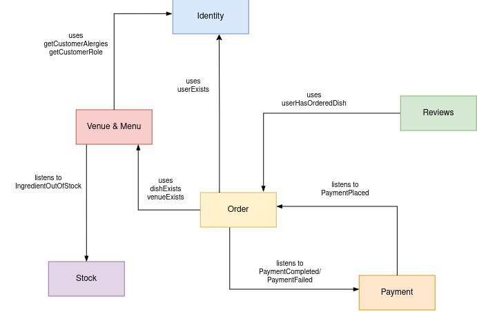

# Restaurant interactive ordering system

## 1. Domain

**Restaurant Business**

Inspired by [Expirenza](https://expz.monobank.ua)  by monobank.

## 2. Key Business scenarios

1. **Restaurant registration and menu creation**  
   Restaurant owner register their venues and add all their dishes to the menu.

2. **Customer places an order**  
   A visitor scans a QR code on the table, views the menu, selects dishes, adds them to the cart, and places an order. A notification about the new order is sent to the kitchen.

3. **Ingredient becomes unavailable**  
   An ingredient required to prepare a dish runs out. Restaurant staff mark the ingredient as unavailable in the application, after which dishes containing this ingredient are no longer displayed in the menu.

4. **Menu filtering by allergens**  
   An authenticated user specifies the products they are allergic to in their profile. The service stops displaying dishes containing the corresponding allergens.

5. **Saving payment data and orders**  
   An authenticated user can save their payment data and order information so that they do not have to enter it again during their next visit.

6. **Dish review and discount coupon**  
   An authenticated user leaves a review for a dish after ordering it and receives a discount coupon for the restaurant.

7. **Restaurant review**  
   An authenticated user can leave a review for a restaurant after ordering food from it at least once.

8. **Order history**  
   An authenticated user can view their order history.

## 3. Bounded Contexts

1. **Identity Context**
2. **Venue & Menu Context**
3. **Stock Context**
4. **Order Context**
5. **Payment Context**
6. **Reviews Context**

## 4. Domain Isolation

### 1. Identity
Responsible for user authentication and identification.

**Entities:** `User`

### 2. Venue & Menu
Responsible for venues, tables, QR codes, and restaurant menus.

**Entities:** `Venue`, `Table`, `QrCode`, `Dish`, `Category`, `Ingredient`, `Allergen`

### 3. Stock
Responsible for ingredient availability. When an ingredient becomes unavailable, the context notifies **Venue & Menu** about the change.

**Entities:** `IngredientStock`, `IngredientAvailability`

### 4. Order
Responsible for historical order information.

**Entities:** `Order`, `OrderItem` (stores a snapshot of the `Dish` information at the time the order is placed, including its name and price)

### 5. Payment
Responsible for processing payments and managing their statuses. After a payment is completed or fails, the context publishes the corresponding event.

**Entities:** `Payment`

### 6. Reviews
Responsible for user reviews of dishes and restaurants, as well as issuing discount coupons after a review is submitted.

**Entities:** `Review`, `Coupon`

## 5. Context Map
